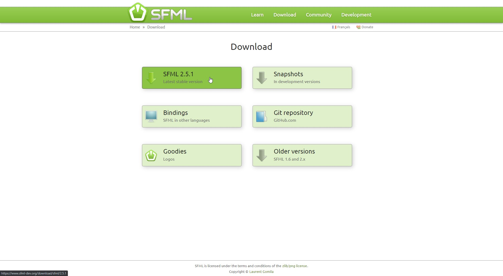

# Туториал по подключению SFML к проекту в Visual Studio 2019

**Основан на [официальном туториале](https://www.sfml-dev.org/tutorials/2.5/start-vc.php)**

## 1. Скачиваем SFML SDK
Скачать можно с [официального сайта](https://www.sfml-dev.org/download.php)

### 1.1 Выбираем "SFML 2.5.1" (последняя актуальная на данный момент версия)



### 1.2 Для Visual Studio 2019 выбираем "Visual C++ 15 (2017)" и разрядность, соответствующую вашей ОС. 


## 2. Создаём проект в Visual Studio (пропускаем, если нужно подключить SFML к уже существующему проекту)

### 2.1 Создаём пустой проект


### 2.2 Пишем в `main.cpp` простой код для проверки работоспособности SFML

```cpp
#include <SFML/Graphics.hpp>

int main()
{
    sf::RenderWindow window(sf::VideoMode(200, 200), "SFML works!");
    sf::CircleShape shape(100.f);
    shape.setFillColor(sf::Color::Green);

    while (window.isOpen())
    {
        sf::Event event;
        while (window.pollEvent(event))
        {
            if (event.type == sf::Event::Closed)
                window.close();
        }

        window.clear();
        window.draw(shape);
        window.display();
    }

    return 0;
}
```

### 2.3 Убеждаемся в том, что код не компилируется, так как SFML не подлючена


## 3. Подключаем SFML

### 3.1 Переходим в свойства проекта

Правой кнопкой мыши по названию проекта в "Solution Explorer", затем "Properties" *или* `Alt` + `Enter`.


### 3.2 Добавляем путь к заголовкам SFML в C/C++ » General » Additional Include Directories

Общий шаблон `<sfml-install-path>\include`.

В моём случае `C:\SFML\SFML-2.5.1-windows-vc15-32-bit\SFML-2.5.1\include`.


### 3.3 Добавляем путь к библиотекам SFML в Linker » General » Additional Library Directories

Общий шаблон `<sfml-install-path>\lib`.

В моём случае `C:\SFML\SFML-2.5.1-windows-vc15-32-bit\SFML-2.5.1\lib`.


### 3.4 Добавляем необходимые SFML библиотеки 

> Важно связать библиотеки, соответствующие конфигурации: «sfml-xxx-d.lib» для отладки (Debug) и «sfml-xxx.lib» для выпуска (Release). Плохой микс может привести к сбою.

> Статические библиотеки SFML имеют суффикс «-s»: «sfml-xxx-sd.lib» для отладки (Debug) и «sfml-xxx-s.lib» для выпуска (Release).

Я использую только статические библиотеки для выпуска. 

> Начиная с SFML 2.2, при статической компоновке вам также нужно будет связать все зависимости SFML с вашим проектом. Это означает, что если вы, например, связываете sfml-window-s.lib или sfml-window-sd.lib, вам также необходимо связать opengl32.lib, winmm.lib и gdi32.lib. Некоторые из этих библиотек зависимостей могут уже быть перечислены в разделе «Унаследованные значения», но их повторное добавление не должно вызывать никаких проблем.

#### Зависимости каждого модуля. Добавьте -d, как описано выше, если вы хотите связать библиотеки SFML для отладки:

| Модуль      | Зависимости|
|-------------|-------------|
| sfml-graphics-s.lib | sfml-window-s.lib; sfml-system-s.lib; opengl32.lib; freetype.lib |
| sfml-window-s.lib | sfml-system-s.lib; opengl32.lib; winmm.lib; gdi32.lib |
| sfml-audio-s.lib | sfml-system-s.lib; openal32.lib; flac.lib; vorbisenc.lib; vorbisfile.lib; vorbis.lib; ogg.lib |
| sfml-network-s.lib | sfml-system-s.lib; ws2_32.lib |
| sfml-system-s.lib | winmm.lib |

#### Список всех библиотек, которые могут понадобиться:

```
sfml-graphics-s.lib
sfml-window-s.lib
sfml-system-s.lib
sfml-audio-s.lib
sfml-network-s.lib
opengl32.lib
freetype.lib
winmm.lib
gdi32.lib
openal32.lib
flac.lib
vorbisenc.lib
vorbisfile.lib
vorbis.lib
ogg.lib
ws2_32.lib
```


### 3.5 Добавляем макрос `SFML_STATIC` в параметрах препроцессора проекта, если используются статические библиотеки


## 4. Возвращаемся к коду

### 4.1 Выбираем необходимую конфигурацию

В моём случае это `Release x86`.


### 4.1 Компилируем и запускаем код


**Если данный туториал был полезен для Вас, поставьте звёздочку ⭐️ на репозиторий.**
