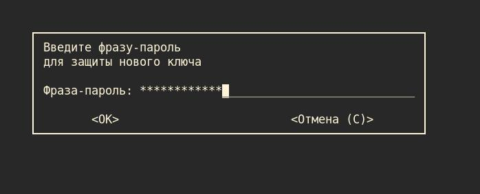

# Про шифрование данных при помощи gpg

* Официальный сайт GnuPG: [gnupg.org](https://www.gnupg.org/)

* Полезные видео про gpg: [Диджитализируй!](https://youtu.be/I2mwqC6HGGE), [Johe News](https://youtu.be/2CwsoGw2coc)

* Статья на Хабре: [Используем GPG для шифрования сообщений и файлов](https://habr.com/ru/post/358182/)

## :mag: Навигация

* [Краткий справочник по командам и опциям](#chapter-0)
* [Генерация новой пары ключей](#chapter-1)
* [Шифрование-расшифрование файлов](#chapter-2)

<a id="chapter-0"></a>
## :page_facing_up: Краткий справочник по командам и опциям

### Опции при запуске `gpg`:

* `--full-generate-key` - генерация новой пары ключей

* `--armor`, `-a` — создаёт ASCII (символьный) вывод (при шифровании GPG по умолчанию создаёт бинарный вывод). Этот символьный вывод можно, например, сохранить в файл или вывести в терминал

* `--encrypt`, `-e` — зашифровать сообщение

* `--recipient`, `-r` — указать ключ, который будет использоваться для шифрования. Можно использовать информацию идентификатор пользователя (имя, почта), идентификатор ключа, отпечаток ключа

* `--decrypt`, `-d` — расшифровать сообщение

* `--list-keys`, `-k` — вывести список публичных ключей

* `--list-secret-keys`, `-K` — вывести список приватных ключей

* `--export` — экспортировать публичный ключ в файл

<a id="chapter-1"></a>
## :new: Генерация новой пары ключей

### 1. Запускаем процесс генерации:
```
gpg --full-generate-key
```

```
gpg (GnuPG) 2.2.29; Copyright (C) 2021 Free Software Foundation, Inc.
This is free software: you are free to change and redistribute it.
There is NO WARRANTY, to the extent permitted by law.

Выберите тип ключа:
   (1) RSA и RSA (по умолчанию)
   (2) DSA и Elgamal
   (3) DSA (только для подписи)
   (4) RSA (только для подписи)
Ваш выбор? 
```

### 2. Выбираем тип шифрования

```
...
Ваш выбор? 1
```

```
длина ключей RSA может быть от 1024 до 4096.
Какой размер ключа Вам необходим? (3072) 
```

### 3. Выбираем размер ключа

```
...
Какой размер ключа Вам необходим? (3072) 4096
```

```
Запрошенный размер ключа - 4096 бит
Выберите срок действия ключа.
         0 = не ограничен
      <n>  = срок действия ключа - n дней
      <n>w = срок действия ключа - n недель
      <n>m = срок действия ключа - n месяцев
      <n>y = срок действия ключа - n лет
Срок действия ключа? (0) 
```

### 4. Выбираем срок действия ключа

```
...
Срок действия ключа? (0) 0
```

```
Срок действия ключа не ограничен
Все верно? (y/N) 
```

### 5. Подстверждаем
```
...
Все верно? (y/N) y
```

### 6. Вводим данные, подтвержаем

```
GnuPG должен составить идентификатор пользователя для идентификации ключа.

Ваше полное имя: Test Test
Адрес электронной почты: test@test.com
Примечание: 
Вы выбрали следующий идентификатор пользователя:
    "Test Test <test@test.com>"

Сменить (N)Имя, (C)Примечание, (E)Адрес; (O)Принять/(Q)Выход? o
```


### 7. Вводим фразу-пароль, подтверждаем



### 8. Ключ сгенерирован!

```
Необходимо получить много случайных чисел. Желательно, чтобы Вы
в процессе генерации выполняли какие-то другие действия (печать
на клавиатуре, движения мыши, обращения к дискам); это даст генератору
случайных чисел больше возможностей получить достаточное количество энтропии.
Необходимо получить много случайных чисел. Желательно, чтобы Вы
в процессе генерации выполняли какие-то другие действия (печать
на клавиатуре, движения мыши, обращения к дискам); это даст генератору
случайных чисел больше возможностей получить достаточное количество энтропии.
gpg: ключ 32597BBB5391DB11 помечен как абсолютно доверенный
gpg: сертификат отзыва записан в '/home/leo/.gnupg/openpgp-revocs.d/B54A23DFFF4A3A848FF8A63032597BBB5391DB11.rev'.
открытый и секретный ключи созданы и подписаны.

pub   rsa4096 2021-11-06 [SC]
      B54A23DFFF4A3A848FF8A63032597BBB5391DB11
uid                      Test Test <test@test.com>
sub   rsa4096 2021-11-06 [E]
```


<a id="chapter-2"></a>

## :lock_with_ink_pen: Шифрование-расшифрование файлов

### 1. Создадим тестовый файл

```bash
echo "Hello World" > file.txt
```

### 2. Зашифровываем

```bash
gpg -e -a -r test@test.com file.txt
```

Генерируется файл `file.txt.asc` с зашифрованным содержимым файла `file.txt`:

```
  1 -----BEGIN PGP MESSAGE-----
  2 
  3 hQIMA/mJUk1ssbqVAQ/8CZ6r8Pj1VimCqUKT3Ao5h7BOTx0jdivRMJsIW0YVHumi
  4 nkBtPJO0LA1d/BSq1YH8R8Pzw/PlPe7qhwO6zWsUqFPqNtp4ppUVOnI/LqXS+opB
  5 /kE2K/HOGdiWOReAZcGtYPODc7mdeK198OPsvs1GTuHIUOnGRrlFPUDDPA6zxavG
  6 mJthA6dl2LlnewmbM7/bnVbFxHtP7nDaikLw04vTJ0Rn2yQePPYuctYzF2qeMc1Q
  7 HzRHxm5GRcZB65JtzuhIrTrM0GqL8nVf24B94M4SsVP6q8Vv4yWSaOfkKpvhVbml
  8 T8Y+VFYU1G0yB5tBGv6MqxqKwc9uAvrllr49v1yqL62AsnAYyfysiOioBd/06xux
  9 yL5akDBKmgcvjtHjvsGnGRjDIHpe8XoINitfRwMOX/cR/46zSZ0muLLT/Zss4HcE
 10 ZG8O5dXbVgzBaMie2csCbcQ7gvWdtr4j6zeDSpjA8jjRtyjBzXN2um55CI+fC9Qe
 11 ZxN+6gy5qjIzD/dFEiLJhjom2fLPgFo1MlDGNFFnsIME9rFDLocL2VEneyKHx+uf
 12 ErvCZ5Z49JSOWeEvo6Jta4d0oF+5YE38uSSi9BDMFjAwomTW4ePlkk0iktO91s/S
 13 IgfYvwNobNMcD3UVw/VeObGgL7nWTdomr0I5mFlT8YH8n0/IwAMzKQE7/46ziITS
 14 TwHpjOx85Ew1kLD8JQxJbmAjyfjoj1RqJQ0oYJcUEBNXPMpK/owY1dCP9/eLuUdW
 15 j8dgn5BxWKMeIuoh54z3Fi4u++JwjTiFVc7m3DS0uc8=
 16 =EtQa
 17 -----END PGP MESSAGE-----

```

### 3. Расшифровываем

```bash
gpg -d -o file-2.txt file.txt.asc
```

Вводим пароль для ключа, которым был зашифрован файл

Генерируется файл `file-2.txt` с расшифрованным содержимым файла `file.txt.asc`:
```
  1 Hello World
```
