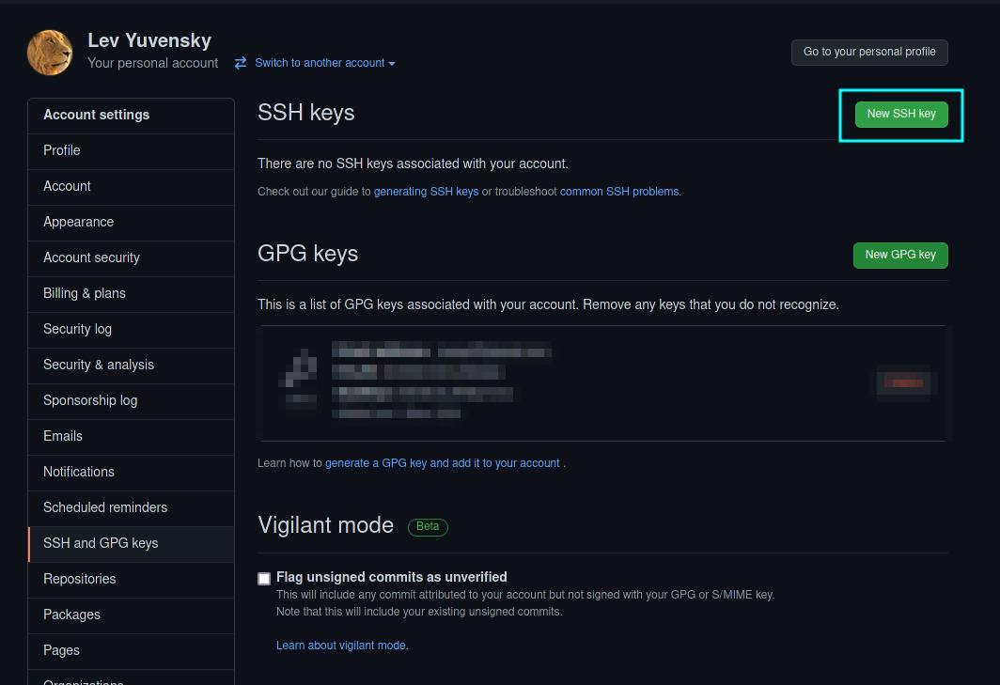
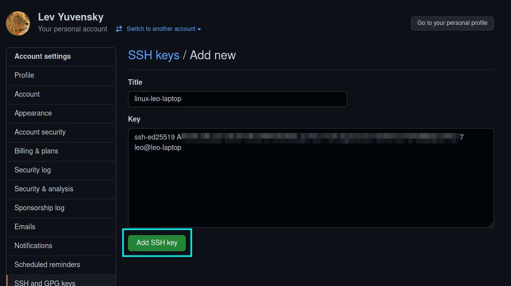
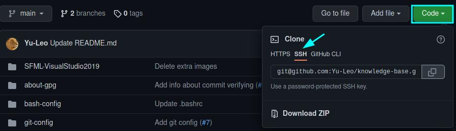

# Как настроить подключение к GitHub через SSH

* Видео по настройке: [Как правильно настроить SSH для GitHub / GitLab ?](https://youtu.be/R09UNc4ZNi4)
* Статья на techrocks: [Как работать с несколькими GitHub-аккаунтами на своей локальной машине](https://techrocks.ru/2020/12/24/how-to-manage-several-github-accounts/)
* Статья на techrocks № 2: [Как эффективно работать с несколькими SSH-ключами](https://techrocks.ru/2020/02/26/multiple-ssh-keys-managing/)
* docs.github: [Connecting to GitHub with SSH](https://docs.github.com/en/authentication/connecting-to-github-with-ssh)

`ssh -V` - получение номера версии

## :arrow_down: Добавление существующего ssh-ключа

1. Создаём папку `~/.ssh`
2. Перемещаем в неё файлы с ключами (в моём случае это `personal_key` и `personal_key.pub`)
3. Меняем права доступа к ключу: `chmod 600 ~/.ssh/personal_key`
4. Добавляем ключ: `ssh-add ~/.ssh/personal_key`
5. При помощи `ssh-add -l` можно убедиться, что ключ добавлен
6. **Настраиваем конфиг, как описано ниже!!!**
7. Добавляем в `~/.bash_profile` следующее ([источник](https://stackoverflow.com/questions/18880024/start-ssh-agent-on-login)):
```bash
SSH_ENV="$HOME/.ssh/agent-environment"

function start_agent {
    echo "Initialising new SSH agent..."
    /usr/bin/ssh-agent | sed 's/^echo/#echo/' > "${SSH_ENV}"
    echo succeeded
    chmod 600 "${SSH_ENV}"
    . "${SSH_ENV}" > /dev/null
    /usr/bin/ssh-add;
}

# Source SSH settings, if applicable

if [ -f "${SSH_ENV}" ]; then
    . "${SSH_ENV}" > /dev/null
    #ps ${SSH_AGENT_PID} doesn't work under cywgin
    ps -ef | grep ${SSH_AGENT_PID} | grep ssh-agent$ > /dev/null || {
        start_agent;
    }
else
    start_agent;
fi

```

## :one: Создание ключа "с нуля"

### 1. Генерируем пару ssh-ключей

```bash
ssh-keygen -t ed25519
```

`-t ed25519` - используем криптографическую функцию эллиптическая кривых ([рекомендует GitHub](./github_docs_ed25519.jpg))

Оставляем файл по умолчанию (`/home/username/.ssh/id_ed25519`).

По желанию задаём пароль.

Для удобства переименуем файлы с ключами

```bash
mv id_ed25519 personal_key
mv id_ed25519.pub personal_key.pub
```

### 2. Настроиваем config файл

Создаём и открываем config файл:
```bash
vim config
```

Вставляем в `config`
```
Host github.com
    HostName github.com
    User git
    IdentityFile ~/.ssh/personal_key
    IdentitiesOnly yes
```

Теперь при работе с github по умолчанию будет использоваться подключение с ключом `personal_key`


### 3. Добавляем ssh ключ в аккаунт github

**"Settings"** -> **"SSH and GPG keys"** -> **"New SSH key"**




В поле **"Key"** вставляем содержимое файла `personal_key.pub`



### Работа с репозиториями

Теперь при клонировании репозиториев с github можно ипользовать SSH



При первом подключении по ssh добавляем github.com в доверенные источники

```
The authenticity of host 'github.com (140.82.121.4)' can't be established.
RSA key fingerprint is SHA256:nThbg6kXUpJWGl7E1IGOCspRomTxdCARLviKw6E5SY8.
This key is not known by any other names
Are you sure you want to continue connecting (yes/no/[fingerprint])? yes
Warning: Permanently added 'github.com' (RSA) to the list of known hosts.
Everything up-to-date
```

## :question: Ответы на вопросы:

### Как сменить адрес удалённого репозитория:

1) Первый способ: задать url репозитория, используя команду `git remote set-url origin`, например,
  ```
  git remote set-url origin git@github.com:Yu-Leo/knowledge-base.git
  ```
2) Второй способ:

  Отредактировать файл **.git/config**: секция `[remote "origin"]` параметр - `url`. 

Эти два способа идентичные. Т.е. вызов команды git remote set-url origin заменит содержимое git конфига.

[Источник](https://jeka.by/ask/137/git-change-origin/)
