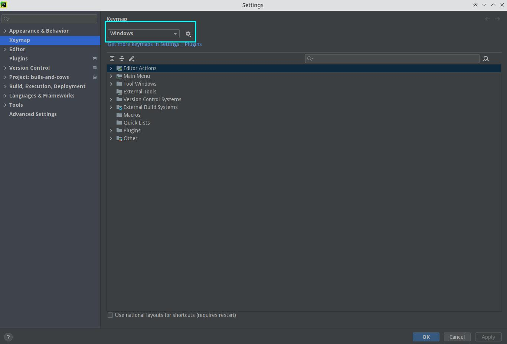
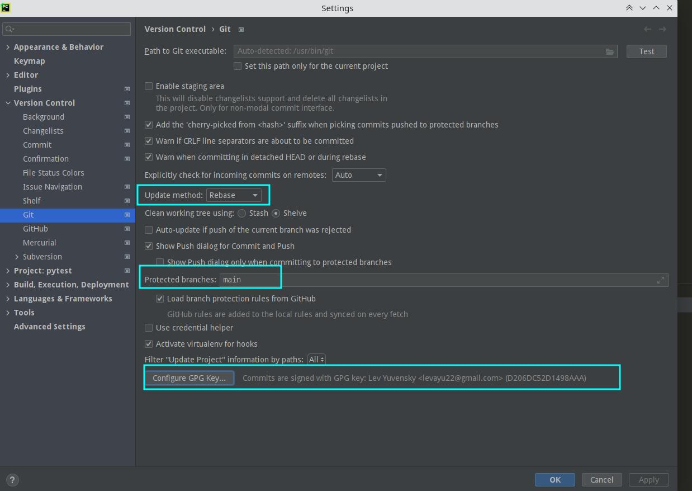
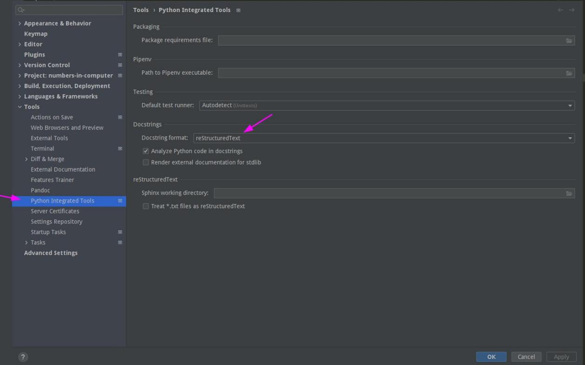

# :wrench: Мои настройки PyCharm

## Appearance & Behavior
### Appearance 

`Use custom font`: **Droid Sans**

`Size`: **14**

## Keymap

## Editor
### Font
`Font`: **JetBrains Mono**

`Size`: **16**

`Line height`: **1.0**

### Color Scheme

`Scheme`: **MyColorSheme** (`Import Scheme`)

Моя цветовая тема: [.jar](YuLeoColourScheme.jar), [.icls](YuLeoColourScheme.icls)

## Version Control
### Git

## Tools
## Python Integrated Tools

