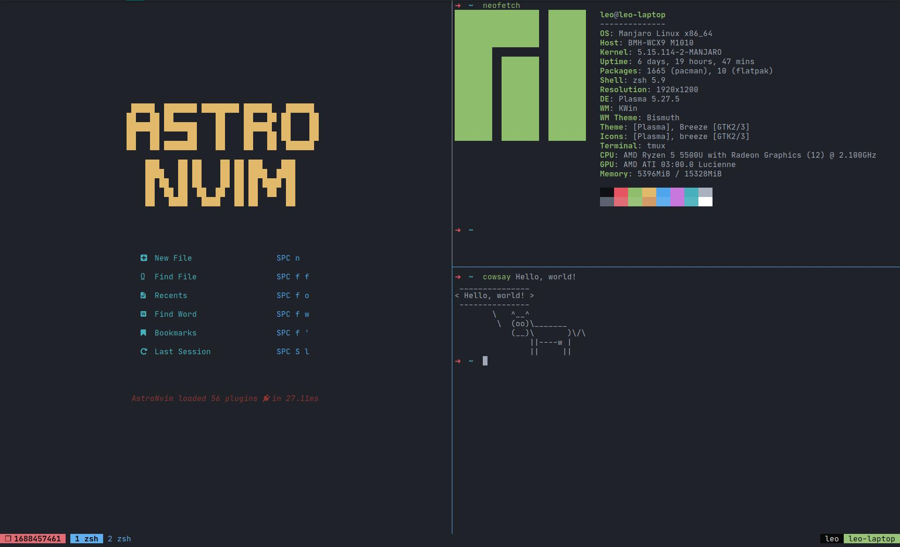

# Tmux

Конфигурация основана на: https://github.com/gpakosz/.tmux

Цветовая схема - onedark (darker)

## Горячие клавиши
`<prefrix>` = `Ctrl+a`
### Общее
- Перечитать конфиг: `<prefix> + r`
- Открыть конфиг в редакторе: `<prefix> + e`
- Сохранить текущее состояние: `<prefix> + Ctrl+s`
- Восстановить сохранённое состояние: `<prefix> + Ctrl+r`
### Сессии
- Создать сессию: `<prefix> + Ctrl+c`
- Создать сессию с именем: `<prefix> + C`
- Показать список сессий: `<prefix> + s`
- Поиск сессии по названию: `<prefix> + Ctrl+f`
- Удалить сессию без выхода из tmux: `<prefix> + X`
- Переименовать сессию: `<prefix> + $`
- Переключиться на сессию по имени: `<prefix> + g`
- Переключиться на предыдущую сессию: `<prefix> + S`
### Вкладки
- Создать вкладку: `<prefix> + с`
- Удалить текущую вкладку: `<prefix> + q`
- Переключиться на вкладку по номеру: `<prefix> + 1-9`
- Переключиться на предыдущую активную вкладку: `<prefix> + Tab`
- Поиск вкладки по названию: `<prefix> + Ctrl+f`
- Показать список вкладок: `<prefix> + w`
- Переименовать вкладку: `<prefix> + ,`
- Переместить текущую вкладку в новую сессию: `prefix + Ctrl+@`
### Окна
- Создать сплит по вертикали: `<prefix> + |` 
- Создать сплит по горизонтали: `<prefix> \`
- Перемещение между окнами: `<prefix> + h/j/k/l`
- Изменение размеров текущего окна: `<prefix> + H/J/K/L`
- Переключиться на предыдущее активное окно: `<prefix> + ;`
- Удалить текущее окно: `<prefix> + x`
- Сдвинуть текущее окно влево/вправо: `<prefix> + </>`
- Открыть текущее окно в новой вкладке: `<prefix> + !`
- Открыть текущее окно в новой сессии: `<prefix> + @`