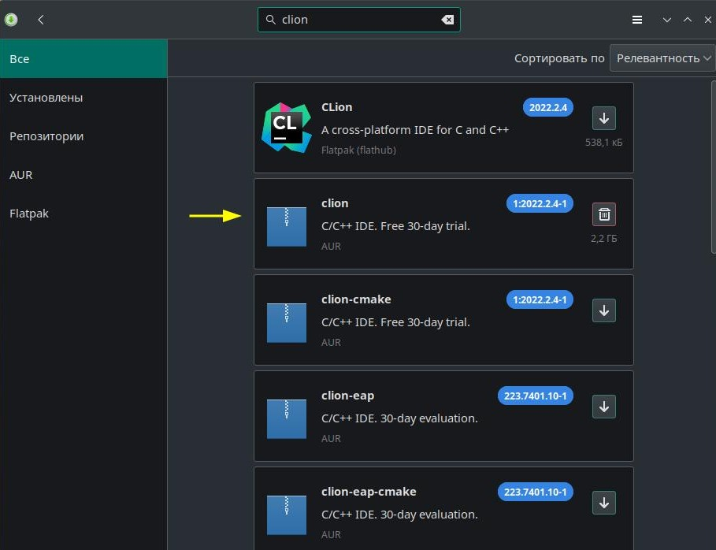
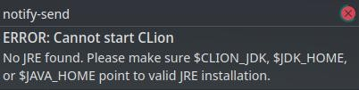

# Установка CLion на Manjaro Linux

## 1. Установка

При установки Flatpack версии у меня возникли ошибки при использовании терминала CLion-а. При установке из AUR такой проблемы не наблюдалось.

Ставим из AUR:



## 2. Исправление ошибки

При запуске возникает ошибка.
```
ERROR: Cannot start CLion
No JRE found. Please make sure $CLION_JDK, $JDK_HOME,
or $JAVA_HOME point to valid JRE installation.
```



### 2.1 Установить OpenJDK
```bash
$ sudo pacman -S jre-openjdk-headless jre-openjdk jdk-openjdk openjdk-doc openjdk-src
```
[Источник](https://linuxconfig.org/how-to-install-java-on-manjaro-linux)


### 2.2 Отредактировать файл `/etc/environment`
Необходимо добавить строчку:
```bash
JAVA_HOME="/usr/lib/jvm/java-19-openjdk"
```
где `/usr/lib/jvm/java-19-openjdk` - путь до устновленного OpenJDK

После чего перечитать файл:
```bash
source /etc/environment
```

[Источник](https://askubuntu.com/questions/175514/how-to-set-java-home-for-java)

## 3. cmake и GDB
Если после устновки CLion не может найти `cmake` и `gdb`, возможно, они не установленны.

В таком случае их нужно установить и прописать пути до них в настройках CLion.

```bash
sudo pacman -S cmake
sudo pacman -S gdb
```

